# Цифровой двойник цеха — Allur, Костанай

Прототип для **Qostanai AI Industry Hackathon 2026, кейс №2** (АО «Группа компаний АЛЛЮР»).

Двойник встаёт над системами завода — 1С:ERP, MES, QLS, WMS, контроллерами оборудования, камерами и телефонами мастеров. Он собирает из их событий живую модель цеха и отвечает руководителю на два вопроса:

- **«Успеваем ли мы план, а если нет, то что сделать прямо сейчас?»**
- **«Где конкретная машина, что с ней было и когда она будет готова?»**

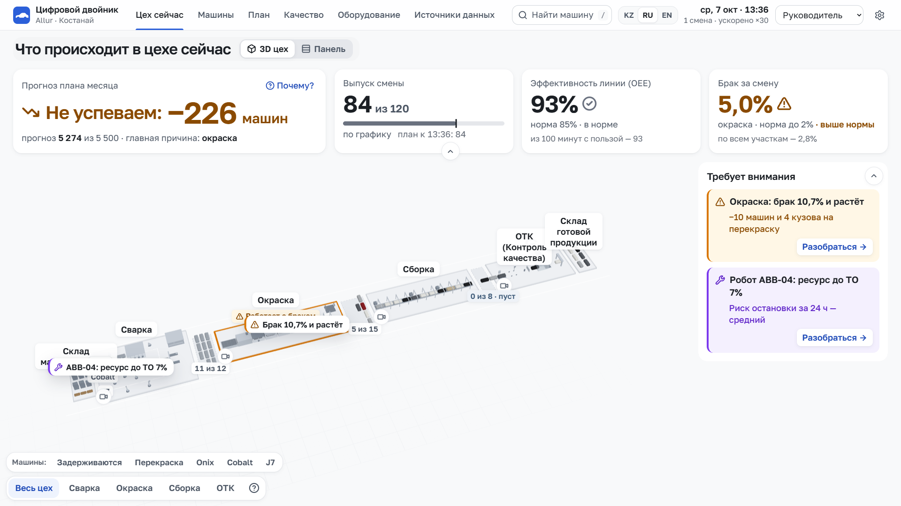

## Запуск одной командой

Нужны Node.js 22.13+ и pnpm 10.

```bash
pnpm i && pnpm dev
```

| Адрес | Что |
|---|---|
| http://localhost:5173 | Интерфейс руководителя (в демо — `?demo`, пульт по клавише **D**) |
| http://localhost:5173/?car=KZACN1S11TK004800 | Сразу машина по VIN или номеру кузова: выбрана, камера ведёт её по цеху |
| http://localhost:5173/master | Экран мастера для телефона |
| http://localhost:3000/docs | Документация API (Swagger, генерируется из Zod-схем) |
| http://localhost:3000/asyncapi | Документация MQTT (AsyncAPI) |
| mqtt://localhost:1883, ws://localhost:3000/mqtt | MQTT для контроллеров и камер |

`pnpm dev` поднимает шлюз, интерфейс и имитаторы систем завода. Работает без интернета и без ключей. При первом запуске имитатор 1С загружает в двойник историю за 30 дней.

Другие команды: `pnpm test` (тесты ядра, контрактов, шлюза и расчётов интерфейса), `pnpm typecheck`, `pnpm build`, `pnpm start` (один сервис: интерфейс + API), `pnpm sim` (имитаторы отдельно).

## Что показывает

| Экран | Вопрос |
|---|---|
| **Цех сейчас** | Что происходит в цехе и что требует внимания прямо сейчас? Прогноз плана месяца, выпуск смены, OEE, брак; 6 участков по потоку с буферами; «Требует внимания»; лента смены. Два вида — 3D и «Панель», ниже |
| **Машины** | Где сейчас все машины: шесть колонок по стадиям, сколько машин на каждой и сколько они там в среднем против нормы; сначала проблемные. Клик — машина в 3D и её карточка |
| **Карточка машины** | Где конкретная машина: модель, цвет, VIN, где сейчас и сколько против нормы, прогресс по 6 стадиям, когда будет готова и отставание от плана, отметки, последние события с источником |
| **Паспорт автомобиля** | Вся история машины: лента всех стадий со временем входа и выхода, нормами, петлями перекраски и выборочным контролем, будущие стадии с ориентировочным временем; операции и условия на оборудовании в момент прохода; «Показать путь в цеху», «Повторить путь» |
| **Панель участка** | Что с участком и почему: сигналы с источниками, оборудование и ресурс, машины на участке и в очереди перед ним, график смены, видео с поста |
| **Инцидент** | История: что случилось → почему (цепочка доказательств) → чем грозит (машины и тенге) → что делать (2–3 варианта, «Принять»). Решение уходит нарядом и пересчитывает прогноз |
| **План** | Успеваем ли план месяца: накопленный выпуск с коридором прогноза, где теряем (узкое место), модели, рычаги «что если» |
| **Качество** | Где брак и почему: брак по участкам, связь с оборудованием, паспорт автомобиля по VIN |
| **Оборудование** | Что скоро сломается: ресурс до ТО, риск за 24 ч, рекомендации, лимит простоя 60 мин |
| **Источники данных** | Откуда данные: ступени внедрения 0/1/2, состояние источников, живой поток сообщений, противоречия в данных, импорт CSV, QR на экран мастера |
| **/master** | Мастер регистрирует простой или брак в два касания — руководитель видит сразу |

Интерфейс на трёх языках: казахский, русский, английский (переключатель KZ / RU / EN в шапке, выбор запоминается).

### «Цех сейчас»: два вида одного состояния

- **«3D цех»** (по умолчанию) — объёмная схема цеха во весь экран: за 3 секунды видно, где проблема. Участки по потоку слева направо, контур цвета статуса, плашки проблем (как «Требует внимания»), каждая машина — на своём месте по трекеру кузовов, цветом своего вида (металл, катафорез, грунт, цвет заказа). Клик по участку — подлёт камеры и панель участка сбоку, по плашке — инцидент, по машине — её карточка. Показатели и «Требует внимания» — плавающие окна, их можно свернуть. Пресеты камеры, «Вернуться к цеху» и Esc; автопоказ — с пульта.
- **«Панель»** — строгий вид для тех, кто работает с цифрами: участки списком по потоку, очереди между ними, раскрытие строки — оборудование, машины на участке и одна линия тренда. Печатается на один лист (Ctrl+P).

Переключение — сегмент в заголовке или клавиша **V**; выбранный участок, выбранная машина, слежение, фильтры и открытый инцидент сохраняются. Прямые ссылки: `/?view=3d`, `/?view=panel`. Без WebGL (или если он упал дважды подряд) двойник сам переходит на «Панель». 3D грузится отдельным чанком только при входе в этот вид. Флаг сборки `VITE_ENABLE_3D=false` скрывает 3D — экран работает как до него. Скорость времени двойника задаётся на экране «Допущения и параметры».

### Где конкретная машина

- **Поиск** в шапке на любом экране (лупа, клавиша **/** или **Ctrl+K**): последние 4–6 знаков VIN, номер кузова, модель, цвет или простые слова — «задерживаются», «перекраска», «на окраске», «линия J7». Выбор — камера подлетает к машине и открывается карточка. Если номера нет среди машин в цеху, двойник ищет в своей истории, и среди уже отгруженных.
- **Быстрые фильтры** в 3D: «Задерживаются», «Перекраска», Onix, Cobalt, J7. Подходящие машины обведены, остальные приглушены, «Показано 7 из 86».
- **Слежение** — «Следить» в карточке или клавиша **T**: камера ведёт машину по цеху, в том числе в лабораторию геометрии и на перекраску; перемещение мышью ставит слежение на паузу («Вернуться к машине»). Машина приехала на склад готовой продукции — «Машина готова и на складе». В «Панели» вместо камеры подсвечена строка участка, где сейчас машина. Ссылку на машину со слежением можно скопировать и отправить коллеге.
- **Наблюдение** — звёздочка в карточке, до 5 машин: значок «Наблюдаю» в шапке со списком и переходами стадий, ненавязчивое уведомление «Onix …004812 перешла в Сборку».
- **Путь в цеху** — линия маршрута машины на полу: пройденное — сплошной линией, впереди — пунктиром, текущее место — пульсирующей точкой, петли перекраски и выборочный контроль — оранжевой дугой.
- **Повтор пути** (из паспорта) — полупрозрачная копия машины проезжает её реальную историю за 24 секунды, вид кузова меняется по этапам; ползунок времени, живой цех при этом работает.

### Управление 3D — как в картах

| Действие | Мышь и тачпад | Клавиатура (фокус на сцене) |
|---|---|---|
| Переместить цех | левая кнопка, один палец, Shift + прокрутка | стрелки или WASD |
| Повернуть и наклонить | правая или средняя кнопка (вокруг точки под курсором), два пальца | Q / E |
| Приблизить | колесо или щипок — к точке под курсором | + / − |
| Подлететь к месту | двойной клик по полу, участку или машине | F — к выбранному, Home — весь цех |
| Выбрать | короткий клик (сдвиг меньше 5 px) | Esc — снять выбор, выйти из слежения |

Подсказка по управлению показывается при первом открытии 3D и по кнопке «?» рядом с пресетами.

| | |
|---|---|
| 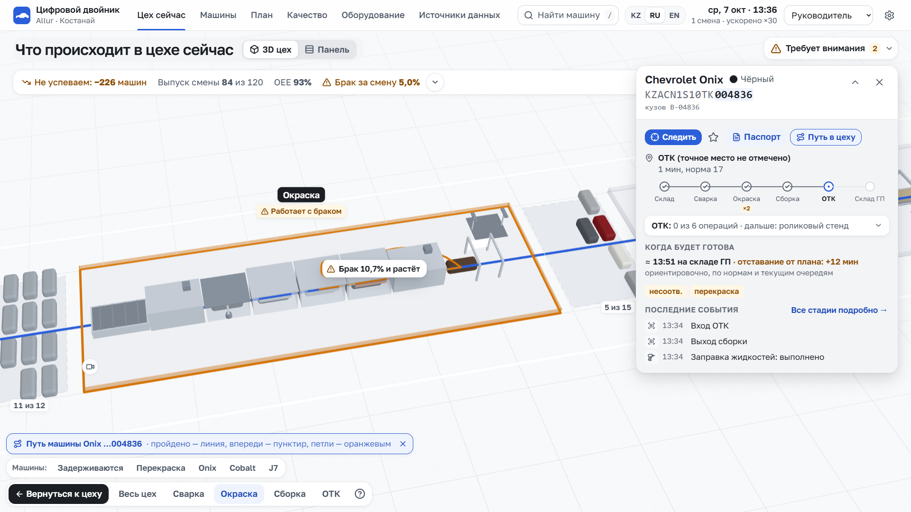 | 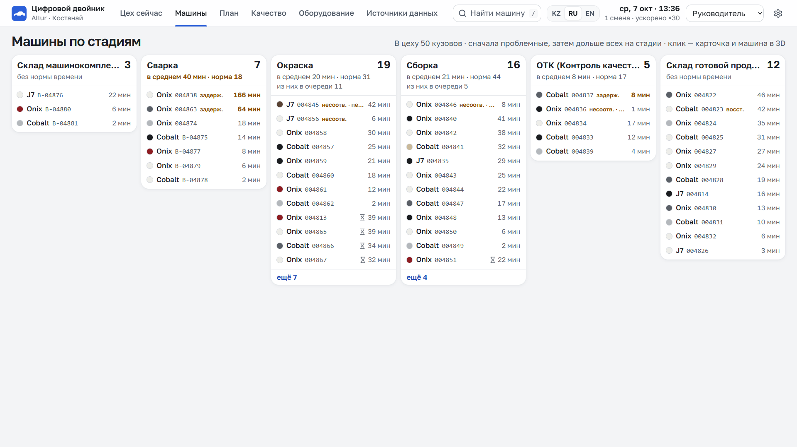 |
| 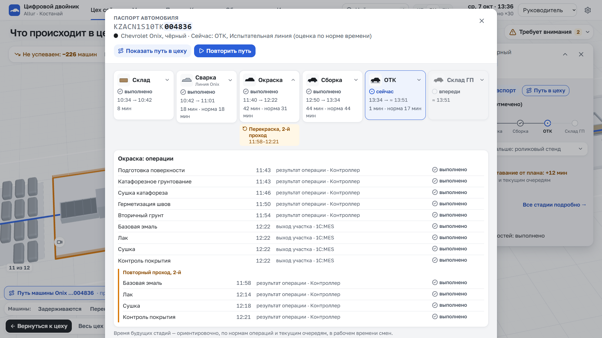 | 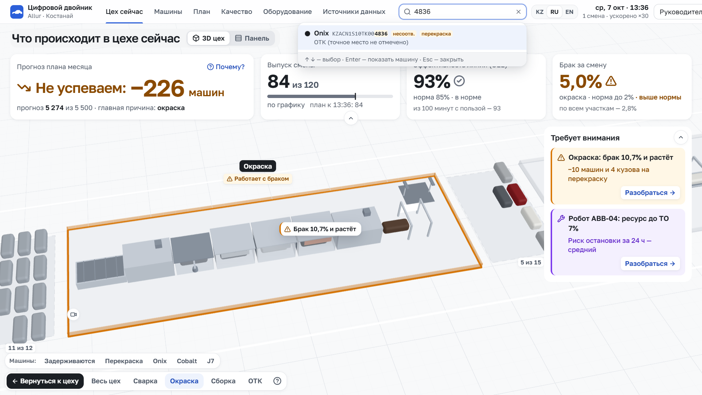 |
| 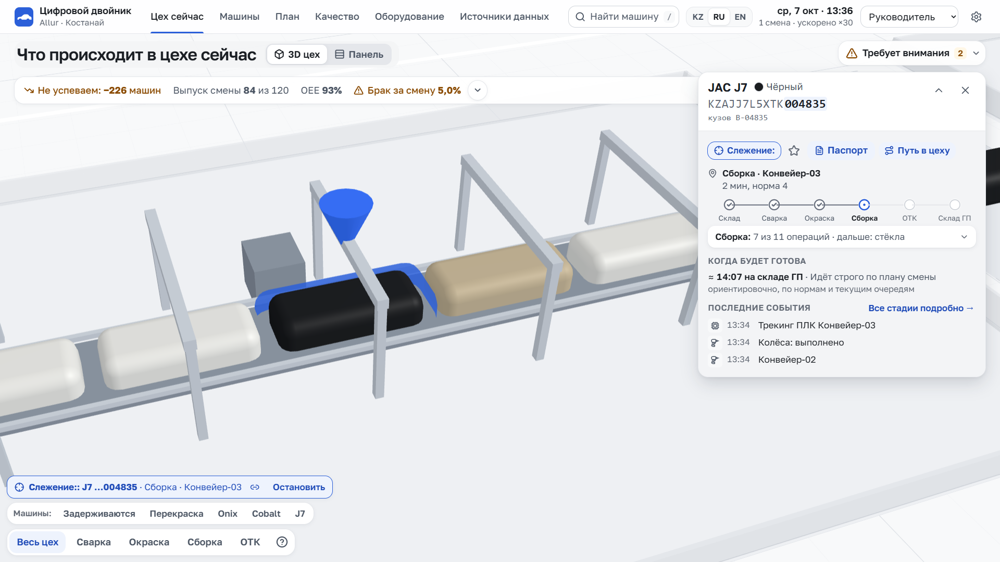 | 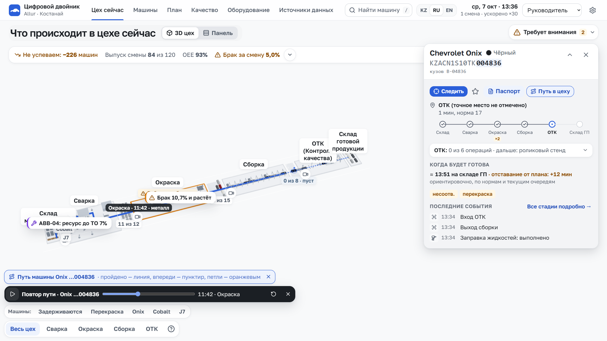 |
| 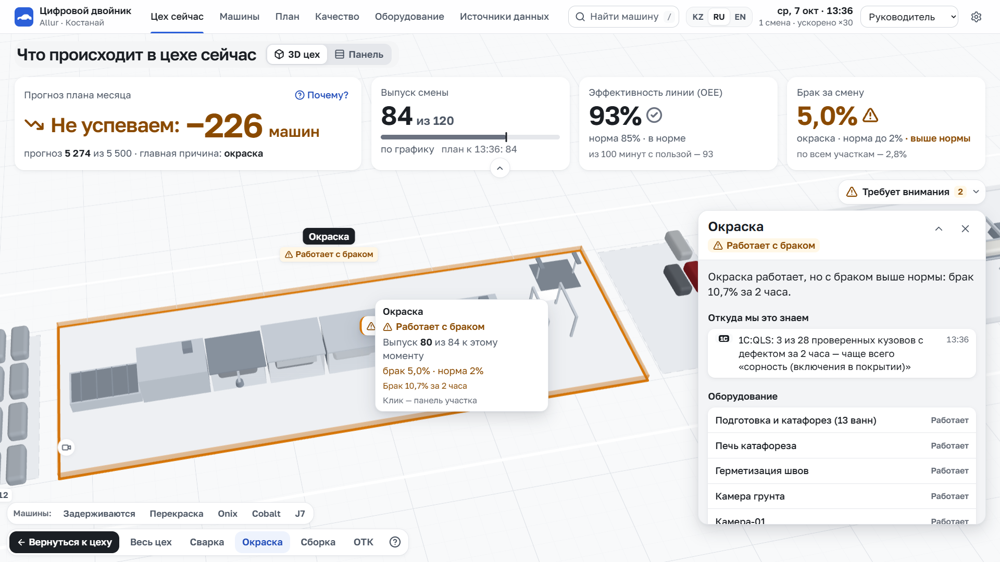 | 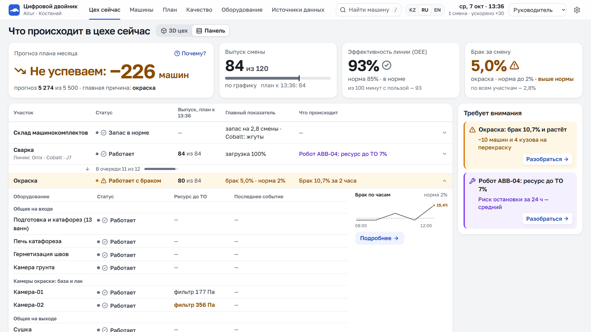 |
| 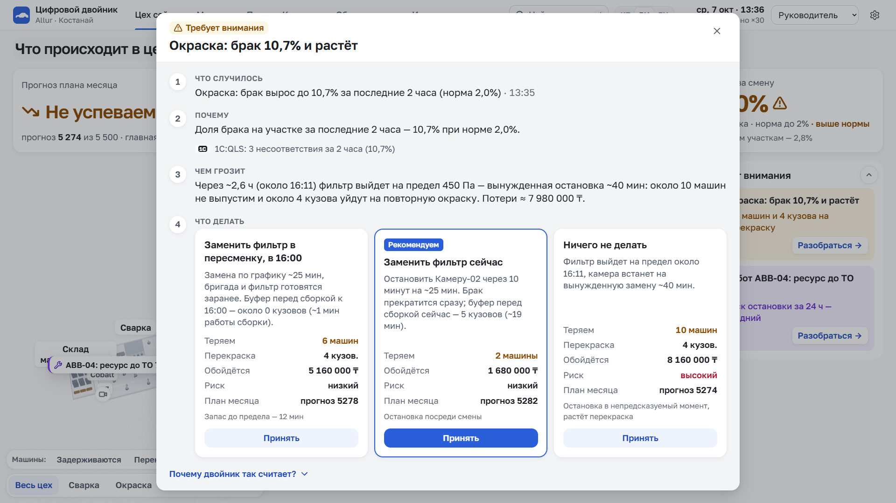 | 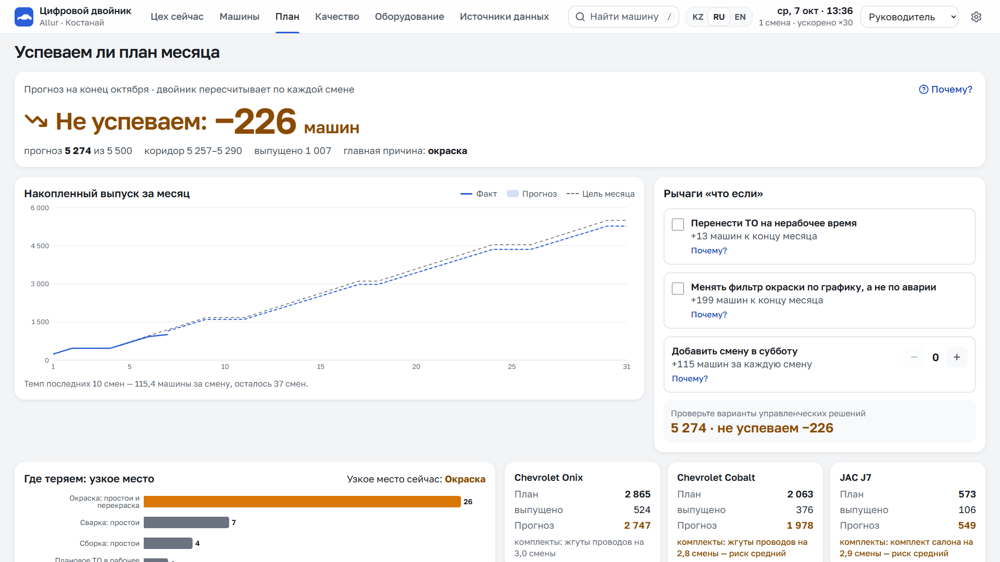 |

## Сценарии (пульт, клавиша D)

1. **Рабочий день** — смена идёт сама, по умолчанию в облаке.
2. **Обычная смена** — отклонения в пределах нормы.
3. **Фильтр окраски** — главный: перепад на фильтре Камеры-02 растёт, двойник по VIN находит связь брака с фильтром, прогнозирует вынужденную остановку через ~3 ч, предлагает варианты; после «Принять» прогноз плана выравнивается.
4. **Обрыв цепи конвейера** — разница ступеней 0/1/2: по проходу VIN через 12 минут, по контроллеру сразу, по току привода заранее.
5. **Комплекты J7 заканчиваются** — перестановка очереди моделей.
6. **Ресурс ABB-04** — ТО ночью.

Сценарии детерминированы (фиксированное зерно): каждый раз проходят одинаково. Сценарий показа на 3 минуты — [docs/DEMO_SCRIPT.md](docs/DEMO_SCRIPT.md).

## Устройство

```
apps/gateway        Fastify: REST /api/v1, MQTT-брокер (Aedes), WebSocket, SQLite (node:sqlite), Swagger
apps/web            React 19 + Vite + Tailwind, Zustand, TanStack Query, Recharts; 3D — three.js + React Three Fiber (отдельный чанк); три языка
packages/contracts  Zod-схемы событий, конфигурация завода, справочники, календарь, OpenAPI, asyncapi.yaml, примеры
packages/twin-core  чистая логика двойника: трекер кузовов, статусы, KPI, инциденты, прогноз, паспорт VIN (тесты Vitest)
packages/simulators модель цеха с seed + имитаторы 1С (HTTP) и контроллеров/камер (MQTT)
docs                архитектура, интеграция, допущения, эффект, сценарий показа, процесс Allur, AI-инструменты
data/organizers     выданные таблицы организаторов в CSV — для импорта
```

Имитаторы не импортируют ядро и ходят в шлюз только по сети — так же пойдут настоящие системы.

## Деплой

Один Docker-сервис: `Dockerfile` и `render.yaml` (Render, бесплатный тариф). Шлюз отдаёт интерфейс, REST, WebSocket и MQTT поверх WebSocket; имитаторы стартуют вместе с ним (`SIMULATORS=on`) и подключаются по сети. Бесплатный хостинг засыпает: при первом открытии видна заглушка «Запускаем двойник…», живой цех появляется через несколько секунд.

**Ссылка на демо:** _добавляется после деплоя_.

## Документация

- [Архитектура](docs/ARCHITECTURE.md) — схема, компоненты, потоки данных, трекер кузовов, интерфейс и 3D, ступени внедрения
- [Интеграция](docs/INTEGRATION.md) — подключение 1С, контроллеров (OPC UA → MQTT), камер; кузова и поиск; ссылка на машину; примеры `curl` и MQTT
- [Допущения и противоречия в данных](docs/ASSUMPTIONS.md) — в том числе как считаются время готовности машины и отставание от плана
- [Эффект, ограничения, условия внедрения](docs/EFFECT.md)
- [Сценарий показа](docs/DEMO_SCRIPT.md)
- [Процесс производства Allur по открытым данным](docs/ALLUR_PROCESS.md)
- [Использованные AI-инструменты](docs/AI_TOOLS.md)

Все данные в прототипе синтетические и откалиброваны по таблицам организаторов. Суммы в тенге условные.
