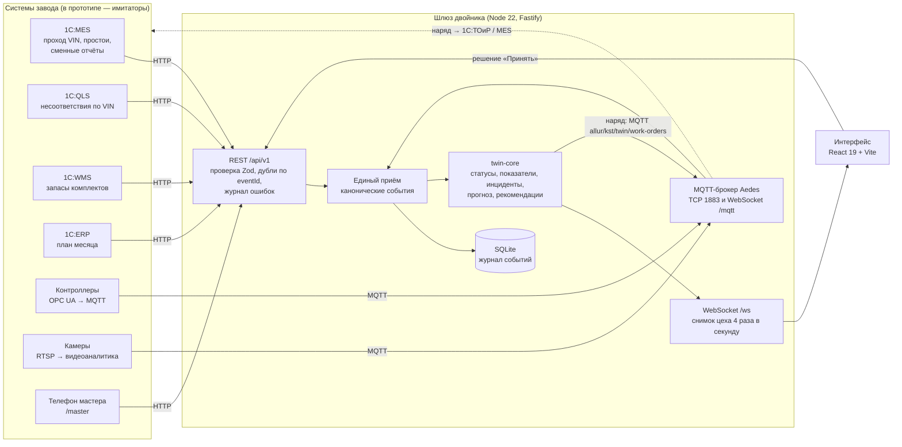

# Архитектура

Цифровой двойник не заменяет системы завода, а встаёт над ними. Он принимает события из 1С (ERP, MES, QLS, WMS), с контроллеров оборудования, с камер и от мастеров через **одну документированную точку входа**, собирает из них живую модель цеха и отвечает руководителю на главный вопрос: **«Успеваем ли мы план, а если нет, то что сделать прямо сейчас?»**

Настоящих систем завода у команды нет, поэтому в прототипе работают **имитаторы**. Они ходят в двойник теми же сетевыми путями, что пойдут настоящие системы: 1С — HTTP REST, контроллеры и видеоаналитика — MQTT. Ядро двойника не знает, что на той стороне имитатор.

## Схема

## Компоненты

| Пакет | Что делает | Почему так |
|---|---|---|
| `packages/contracts` | Zod-схемы всех сообщений, справочники цеха, календарь, генерация OpenAPI, `asyncapi.yaml`, примеры | Один источник правды: по этим схемам проверяются входы и строится документация |
| `packages/twin-core` | Чистая логика двойника без сети: состояние из событий, статусы участков, KPI, инциденты, прогноз, паспорт VIN, проверка данных | Детерминированно и тестируемо (Vitest); каждое вычисление возвращает объяснение для «Почему?» |
| `packages/simulators` | Физическая модель цеха с seed и адаптеры: mes-1c, qls-1c, wms-1c (HTTP), plc и camera (MQTT); генератор 30 дней истории | Имитаторы не импортируют `twin-core` и ходят в шлюз только по сети |
| `apps/gateway` | REST, MQTT-брокер, WebSocket, SQLite, Swagger, часы демо; отдаёт собранный интерфейс | Один сервис — проще деплой: Render/Railway, один порт |
| `apps/web` | Интерфейс: 5 экранов руководителя, экран мастера, пульт демо | React 19, Tailwind, Zustand (живое состояние), TanStack Query (REST), Recharts |

## Потоки данных

1. **Вход.** Каждое сообщение проверяется схемой. Некорректное не теряется молча: оно попадает в журнал ошибок с причиной по-русски и видно на экране «Источники данных». Повтор с тем же `eventId` дубля не создаёт.
2. **Нормализация.** Любой вход — REST 1С, MQTT контроллера, телефон мастера, импорт CSV — превращается в каноническое событие `{eventId, source, ts, area, equipmentId?, vin?, type, payload}`. Типы: `post_passed`, `nonconformity`, `downtime_registered`, `equipment_state`, `equipment_counter`, `telemetry`, `camera_detection`, `stock_level`, `plan_set`, `shift_report`, `quality_summary`.
3. **Модель цеха.** `twin-core` хранит, где какой кузов (по последнему посту в 1С:MES), сколько кузовов в буферах, состояния и счётчики оборудования, телеметрию, несоответствия по VIN, простои, сменные отчёты, запасы и план.
4. **Правила.** Каждые 250 мс шлюз даёт ядру «тик» часов. Ядро пересчитывает статусы участков по правилам раздела 9.1: сначала контроллер, затем запись мастера, затем вывод по проходу VIN и буферам, затем качество. Инциденты и прогноз пересчитываются раз в 20 секунд времени двойника.
5. **Решение.** «Принять» отправляет `POST /api/v1/decisions`. Ядро фиксирует решение и выдаёт наряд, шлюз публикует его в MQTT `allur/kst/twin/work-orders`. В реальном внедрении наряд уходит в 1С:ТОиР или MES. В прототипе его «выполняют» имитаторы: фильтр меняется в назначенное время.
6. **Интерфейс.** Снимок цеха приходит по WebSocket. Подробности (панель участка, инцидент, прогноз с рычагами, паспорт VIN) запрашиваются по REST.

## Ступени внедрения

| Ступень | Что подключено | Что видит двойник |
|---|---|---|
| 0 | 1С:MES, QLS, WMS, ERP | Статусы по проходу VIN: остановка видна через 3 такта (12 мин), без кода аварии. Наработка роботов — по числу кузовов. |
| 1 | + контроллеры и камеры, которые уже стоят | Аварии с кодом почти сразу, перепад на фильтрах окраски, микропростои и «неучтённые потери», видео с постов |
| 2 | + датчики на критичных узлах | Ток и вибрация привода конвейера: ранний прогноз обрыва цепи за 30–60 минут |

Ступень переключается на экране «Источники данных». Имитаторы контроллеров и камер подключаются и отключаются, а ядро честно работает с тем, что пришло.

## Демонстрация и воспроизводимость

- Часы демо живут в шлюзе: время симуляции, скорость ×1/×30/×60/×300, пауза, сброс, сценарий. Имитаторам они идут по служебному топику `allur/kst/demo/clock`, который не входит в контракт интеграции. Нерабочая ночь пропускается.
- Сценарий детерминирован: одно зерно и один сценарий дают одну и ту же смену. Смена всегда начинается в 08:00 7 октября; до момента сценария имитаторы быстро прокручивают утро.
- Сброс удаляет события текущего прогона. Начальная загрузка истории из 1С (`eventId` с префиксом `hist:`) и импорт таблиц сохраняются.

## Технологии

Node 22+, TypeScript, pnpm workspaces. Fastify 5, Aedes (MQTT), ws, встроенный `node:sqlite` (без нативной сборки). Zod 4 (валидация, JSON Schema, OpenAPI 3.1), Swagger UI. React 19, Vite 8, Tailwind 4, Zustand, TanStack Query, Recharts, lucide-react, шрифт Golos Text (из npm, работает без интернета). Vitest. Внешних платных сервисов и обязательных ключей нет.
