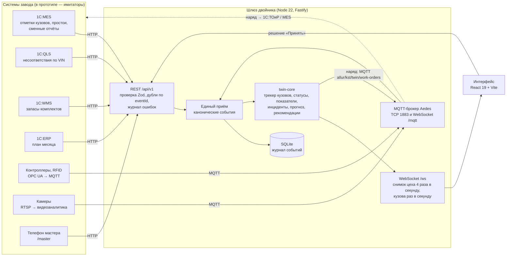

# Архитектура

Цифровой двойник не заменяет системы завода, а встаёт над ними. Он принимает события из 1С (ERP, MES, QLS, WMS), с контроллеров оборудования, с камер и от мастеров через **одну документированную точку входа**, собирает из них живую модель цеха и отвечает руководителю на два вопроса: **«Успеваем ли мы план, а если нет, то что сделать прямо сейчас?»** и **«Где конкретная машина, что с ней было и когда она будет готова?»**

Настоящих систем завода у команды нет, поэтому в прототипе работают **имитаторы**. Они ходят в двойник теми же сетевыми путями, что пойдут настоящие системы: 1С — HTTP REST, контроллеры и видеоаналитика — MQTT. Ядро двойника не знает, что на той стороне имитатор.

## Схема

## Компоненты

| Пакет | Что делает | Почему так |
|---|---|---|
| `packages/contracts` | Zod-схемы всех сообщений, конфигурация завода (схема, исходный состав, каталог типов оборудования, проверка), календарь, генерация OpenAPI, `asyncapi.yaml`, примеры | Один источник правды: по этим схемам проверяются входы и строится документация |
| `packages/twin-core` | Чистая логика двойника без сети: трекер кузовов, состояние из событий, статусы участков, KPI, инциденты, прогноз, паспорт VIN, проверка данных | Детерминированно и тестируемо (Vitest); каждое вычисление возвращает объяснение для «Почему?» |
| `packages/simulators` | Физическая модель цеха с seed и адаптеры: mes-1c, qls-1c, wms-1c (HTTP), plc и camera (MQTT); генератор 30 дней истории | Имитаторы не импортируют `twin-core` и ходят в шлюз только по сети |
| `apps/gateway` | REST, MQTT-брокер, WebSocket, SQLite, Swagger, часы демо; отдаёт собранный интерфейс | Один сервис — проще деплой: Render/Railway, один порт |
| `apps/web` | Интерфейс: «Цех сейчас» (3D и «Панель»), «Машины», «План», «Качество», «Оборудование», «Источники данных», карточка и паспорт машины, поиск, экран мастера, пульт демо; казахский, русский, английский | React 19, Tailwind, Zustand (живое состояние), TanStack Query (REST), Recharts; 3D — three.js и React Three Fiber отдельным чанком |

## Потоки данных

1. **Вход.** Каждое сообщение проверяется схемой. Некорректное не теряется молча: оно попадает в журнал ошибок с причиной по-русски и видно на экране «Источники данных». Повтор с тем же `eventId` дубля не создаёт.
2. **Нормализация.** Любой вход — REST 1С, MQTT контроллера, телефон мастера, импорт CSV — превращается в каноническое событие `{eventId, source, ts, area, equipmentId?, vin?, type, payload}`. Типы: отслеживание кузова — `production_order`, `body_checkpoint`, `operation_result`, `vin_assigned` (прежний `post_passed` тоже принимается); `nonconformity`, `downtime_registered`, `equipment_state`, `equipment_counter`, `telemetry`, `camera_detection`, `stock_level`, `plan_set`, `shift_report`, `quality_summary`.
3. **Модель цеха.** `twin-core` хранит, где каждый кузов и что с ним сделано (трекер кузовов, ниже), сколько кузовов в буферах, состояния и счётчики оборудования, телеметрию, несоответствия по VIN, простои, сменные отчёты, запасы и план. Очереди, загрузка и выпуск участков считаются по переходам трекера.
4. **Правила.** Каждые 250 мс шлюз даёт ядру «тик» часов. Ядро пересчитывает статусы участков по правилам раздела 9.1: сначала контроллер, затем запись мастера, затем вывод по проходу VIN и буферам, затем качество. Инциденты и прогноз пересчитываются раз в 20 секунд времени двойника.
5. **Решение.** «Принять» отправляет `POST /api/v1/decisions`. Ядро фиксирует решение и выдаёт наряд, шлюз публикует его в MQTT `allur/kst/twin/work-orders`. В реальном внедрении наряд уходит в 1С:ТОиР или MES. В прототипе его «выполняют» имитаторы: фильтр меняется в назначенное время.
6. **Интерфейс.** Снимок цеха приходит по WebSocket 4 раза в секунду, список кузовов (`{t:'bodies'}`) — раз в секунду. Подробности (панель участка, инцидент, прогноз с рычагами, кузов с маршрутом и историей, паспорт VIN, поиск по истории) запрашиваются по REST.

## Трекер кузовов

`packages/twin-core/src/tracker.ts` ведёт каждую машину от заказа до склада готовой продукции.

- **Кто это.** Номер кузова `bodyId` — с заказа (`production_order`: модель, комплектация, цвет). VIN — с нанесения на сварке (`vin_assigned`); дальше машина находится и по номеру, и по VIN.
- **Маршрут.** При заказе трекер строит маршрут операций по конфигурации завода: участки по порядку, станция модели (своя сварочная линия у Onix, Cobalt, J7), операции на постах с нормами и визуальными эффектами (металл, катафорез, грунт, цвет, сборка, стенд), выборочные операции (лаборатория геометрии, полировка, полигон).
- **Отметки.** `body_checkpoint` — вход и выход участка, станции или оборудования; способ отметки задан в конфигурации (`mes_scan`, `rfid`, `plc_tracking`, `tool_result`, `manual`). `operation_result` — операция выполнена или нет. Точность места: со сканом 1С:MES — до участка, место на участке оценивается по норме времени и помечается как оценка; с RFID и ПЛК — до поста.
- **Грязные данные.** Пропущенная отметка достраивается по маршруту и помечается как восстановленная; опоздавшая отметка подтверждает восстановленную. Отметка не по порядку не применяется и попадает в «Противоречия в данных». Повтор той же отметки в течение минуты не учитывается. Перекраска по решению 1С:QLS открывает операции окраски заново (новый проход, `loop`).
- **Что отдаёт.** `BodyView` — где машина, с какого момента на месте и на участке, норма, вид кузова, флаги (задерживается — дольше нормы в 1,5 раза; несоответствие; перекраска; восстановленная отметка; цвет не передан). `BodyDetail` — плюс маршрут операций со статусами, временем и источником, проходы участков (`stages`: вход и выход, повторные проходы отдельно) и история отметок.

## Интерфейс: машины и 3D

- **Общее состояние.** Выбранный участок и машина, слежение, путь машины, фильтры, открытый паспорт — в одном сторе (`apps/web/src/state/view.ts`), одинаково для «3D цех» и «Панели»; переключение режима ничего не сбрасывает. Список наблюдения — в памяти браузера (до 5 машин).
- **Расчёты на фронте** (`apps/web/src/state/cars.ts`, `stages.ts`, `search.ts`, `board.ts`, покрыты тестами): где машина словами, прогресс по стадиям, прогноз стадий и время готовности (по нормам операций из конфигурации и текущим очередям, в рабочем времени смен), отставание от плана, лента стадий для паспорта, колонки «Машин по стадиям», поисковый индекс в памяти (500 машин — меньше 50 мс). Поиск по истории — `GET /api/v1/bodies?query=` на шлюзе.
- **3D.** Схема цеха строится из конфигурации завода (`layout.ts`). Все машины — один `InstancedMesh`; номер экземпляра → номер кузова обновляется в каждом кадре; выбранная, наведённая и подходящие под фильтр машины подсвечены отдельными мешами поверх экземпляров, без постобработки. Камера — `camera-controls` в режиме «как в картах»: перемещение по полу, вращение вокруг точки под курсором, масштаб к курсору, мягкие границы цеха, плавные перелёты, слежение за машиной. Путь машины и повтор истории строятся по её маршруту и раскладке.
- **Производительность.** Сцена рисуется только когда что-то меняется. Наведение мыши живёт в отдельном маленьком сторе и не перерисовывает сцену; модели оборудования, зоны и буферы перерисовываются только при изменении своих данных; без размытия фона поверх WebGL. Цель — 45+ кадров в секунду при 120 машинах со слежением и путём (на тестовой машине — 130+).
- **Языки.** Казахский, русский, английский (`apps/web/src/i18n`): словари интерфейса и перевод динамических строк ядра; выбор запоминается в браузере.

## Конфигурация завода

Состав цеха (участки, станции, оборудование, буферы, способы подключения) не зашит в код. Он хранится как версионируемая конфигурация `PlantConfig`. Схема лежит в `packages/contracts/src/plant-config.ts`, исходный состав — в `plant-seed.ts`, каталог типов оборудования — в `equipment-catalog.ts`.

- **Модель участка.** Участок устроен так: общий вход (подготовка поверхности) → параллельные станции, каждая из которых — цепочка оборудования → общий выход (печь сушки). Между производственными участками стоят буферы.
- **Мощность.** Мощность станции задаёт самое медленное оборудование. Мощность участка — сумма станций, ограниченная общим оборудованием. Эффективная мощность учитывает доступность за 30 дней и долю перекраски. Узкое место — участок с наименьшей эффективной мощностью.
- **Один источник правды.** Ядро двойника (статусы, KPI, прогноз, инциденты), имитаторы и 3D-схема строятся из одной конфигурации (`derivePlant`). Если остановилась одна из нескольких параллельных станций, участок получает статус «Снижена мощность», а не «Авария».
- **Версии.** Шлюз хранит все версии в SQLite (`plant_versions`). История линейная: применение и откат создают новую версию с автоматическим списком изменений.
- **Проверка перед применением** (`validatePlant`): склады на своих местах, буферы между участками, уникальные коды, лимиты. Оборудование с открытым инцидентом удалить нельзя.
- **Рассылка.** Интерфейс получает новую версию по WebSocket (`{t:'plant'}`). Имитаторы и внешние шлюзы получают retained-сообщение MQTT `allur/kst/twin/plant-config`, а полный состав забирают по `GET /api/v1/plant/config`.
- **Статус подключения** шлюз вычисляет по факту прихода данных. «Подключено» — данные приходили не позже 60 с назад, иначе «Данные устарели».
- **Проверка подключения.** Для имитатора это настоящий опрос по MQTT. Для OPC UA, Modbus TCP, S7 и SCADA шлюз проверяет адрес и честно сообщает, что он недоступен из демо-среды.
- **Демо.** Запуск сценария возвращает исходный состав цеха новой версией. Главный сценарий всегда идёт на исходной конфигурации.

## Ступени внедрения

| Ступень | Что подключено | Что видит двойник |
|---|---|---|
| 0 | 1С:MES, QLS, WMS, ERP | Статусы по проходу VIN: остановка видна через 3 такта (12 мин), без кода аварии. Наработка роботов — по числу кузовов. Машина видна до участка, место на участке — оценка по норме времени |
| 1 | + контроллеры, RFID и камеры, которые уже стоят | Аварии с кодом почти сразу, перепад на фильтрах окраски, микропростои и «неучтённые потери», видео с постов. Машина видна до поста, операции подтверждены результатами роботов и инструмента |
| 2 | + датчики на критичных узлах | Ток и вибрация привода конвейера: ранний прогноз обрыва цепи за 30–60 минут |

Ступень переключается на экране «Источники данных». Имитаторы контроллеров и камер подключаются и отключаются, а ядро честно работает с тем, что пришло.

## Демонстрация и воспроизводимость

- Часы демо живут в шлюзе: время симуляции, скорость ×1/×30/×60/×300, пауза, сброс, сценарий. Имитаторам они идут по служебному топику `allur/kst/demo/clock`, который не входит в контракт интеграции. Нерабочая ночь пропускается.
- Сценарий детерминирован: одно зерно и один сценарий дают одну и ту же смену. Смена всегда начинается в 08:00 7 октября; до момента сценария имитаторы быстро прокручивают утро.
- Сброс удаляет события текущего прогона. Начальная загрузка истории из 1С (`eventId` с префиксом `hist:`) и импорт таблиц сохраняются.

## Технологии

Node 22+, TypeScript, pnpm workspaces. Fastify 5, Aedes (MQTT), ws, встроенный `node:sqlite` (без нативной сборки). Zod 4 (валидация, JSON Schema, OpenAPI 3.1), Swagger UI. React 19, Vite 8, Tailwind 4, Zustand, TanStack Query, Recharts, lucide-react, шрифт Golos Text (из npm, работает без интернета). Vitest. Внешних платных сервисов и обязательных ключей нет.
